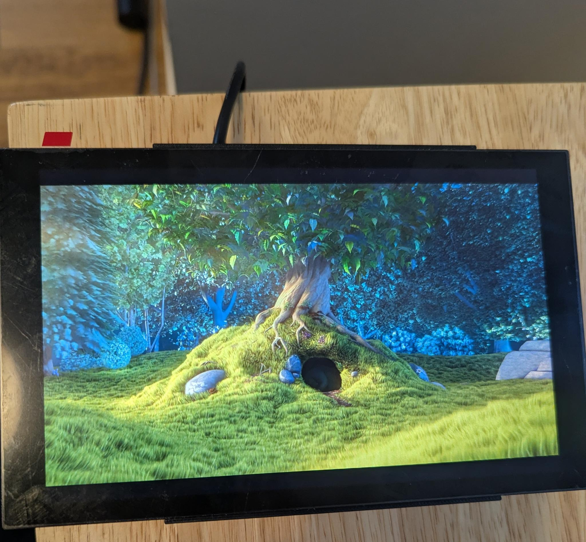
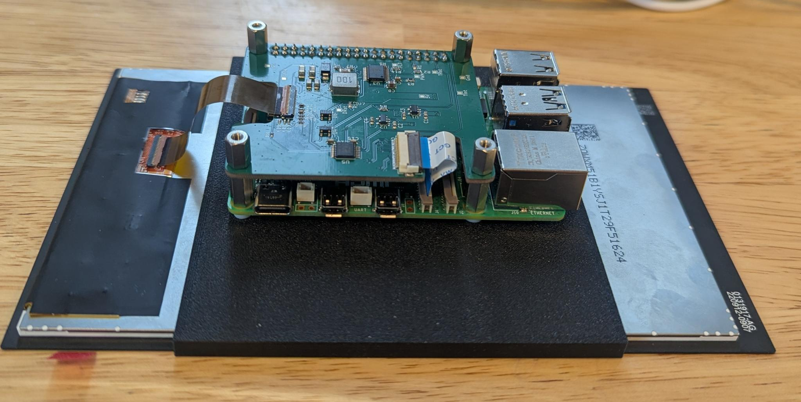
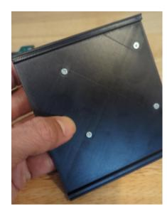
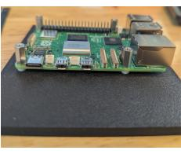
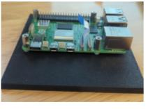
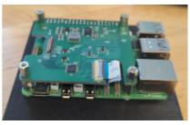

# TV070WXM-HAT

A Raspberry Pi 5 HAT form-factor adapter that connects the **BOE TV070WXM-TV1-3GP1** MIPI-DSI LCD touch panel (the same display used in the LCD Steam Deck) to a Raspberry Pi 5.

<table>
  <tr>
    <td align="center"></td>
    <td align="center"></td>
  </tr>
  <tr>
    <td align="center"><b>Front</b></td>
    <td align="center"><b>Back</b></td>
  </tr>
</table>

## Description

The TV070WXM-HAT breaks out a MIPI-DSI + touch interface so you can drive the **BOE TV070WXM-TV1-3GP1** panel (the original Steam Deck LCD) directly from a Raspberry Pi 5. Two flat-flex cables carry DSI/touch between the Pi's DISP connector, the HAT, and the panel, and a 3D-printed bracket holds the whole stack together behind the display.

## What's in this repo

- **KiCad project** — schematic (with full BOM), board layout, and Gerbers, ready to send to a fab.
- **3D-printable bracket** — a simple STEP that sandwiches the Pi 5, HAT, and panel into one rigid assembly.
- **Linux Kernel patch** — a patch containing the driver and DTS files needed to make the display work on Linux.

## Parts needed for assembly

> [!WARNING]
> **This HAT is only expected to work with the official Raspberry Pi 5 27 W (5.1 V / 5 A) USB-C power supply.**
> Other power supplies will cause instability and brownouts unless they support 5 A current via USB-PD negotiation This is incredibly rare.

| Qty | Item | Digi-Key P/N | Notes |
|:---:|------|--------------|-------|
| 1 | BOE TV070WXM-TV1-3GP1 panel | — | The Steam Deck LCD panel |
| 1 | Raspberry Pi 5 (with SD card) | — | |
| 1 | Raspberry Pi 5 official 27 W PSU | — | **Required** — see warning above |
| 1 | TV070WXM-HAT | — | This project — fab it from the included Gerbers |
| 1 | FFC, Pi 5 ↔ HAT | `2073-05-22-D-0030-A-4-06-4-T-ND` | 22-pin, 0.5 mm, 30 mm, opposite-side contacts (GCT type D) |
| 1 | FFC, HAT ↔ display panel | `WM9283-ND` | Molex 0150150239 — 39-pin, 0.3 mm, 2" |
| 1 | 3D-printed bracket | — | STEP in this repo |
| 4 | 8mm M2.5X0.45 flat head screws | McMaster P/N 92010A018 | Source : McMaster Carr| 
| 4 | 2.54 mm round nylon spacers | `492-1768-ND` | Between bracket and Pi 5 |
| 4 | 11 mm M2.5×0.45 F/F standoffs | `R25-1001102-ND` | Between Pi 5 and HAT **(See note about accommodating heatsink/cooler)**|
| 4 | 8 mm M2.5×0.45 M/F standoffs | `AE10794-ND` | Above the HAT — the feet the assembly stands on |

## Assembly

> [!NOTE]
> This HAT is also compatible with the CM4 IO board, but it would require a much longer FFC between the DISP1 of the CM4 IO board and the J2 of the HAT to work. However, the hardware documentation focuses exclusively on the Raspberry Pi 5. The software documentation below includes instructions for the CM4.

### Step 1 — Mount the Pi 5 to the bracket

Using the screws, the white plastic spacers, and the female-to-female standoffs, secure the Raspberry Pi 5 to the bracket. The stack order at each corner is: **screw → spacer → Pi 5 → standoff**.
<table>
  <tr>
    <td align="center"></td>
    <td align="center"></td>
  </tr>
  </table>


### Step 2 — Connect and mount the HAT

> [!NOTE]
> To fit a Raspberry Pi 5 heatsink/active cooler between the Pi 5 and the HAT, you'll need a **taller GPIO header extender** and **longer standoffs** to clear the cooler's height. For the GPIO extender, consider Digikey P/N 1568-16763-ND, and for the longer standoffs (alternative to the 11mm standoffs), consider 25mm (Digikey P/N AE10862-ND) or 30mm (Digikey P/N 732-10626-ND)

Plug the small FFC ZIF cable into the **CAM/DISP1 connector** on the Pi 5, and plug the other end into the HAT. Seat the ZIF cable **before** mounting the HAT onto the 40-pin header — it's much easier that way. Then mount the HAT onto the Pi 5 and screw the male-female standoffs into the corners of the HAT. These are the legs the assembly stands on.
<table>
  <tr>
    <td align="center"></td>
    <td align="center"></td>
  </tr>
  </table>

### Step 3 — Connect the panel

Place the bracket on top of the display, then plug in the second FFC ZIF connector between the HAT and the display panel. Turn the assembly around and the hardware is ready.

## Driver / software

The display will not light up on hardware alone — it needs a Linux kernel panel driver and matching device-tree overlays.

This repository includes the interim kernel patch:

**[`linux-rpi-6.12.y-panel-boe-tv070wxm.patch`](./linux-rpi-6.12.y-panel-boe-tv070wxm.patch)**

The long-term plan is to submit the driver to Linux mainline. Until that happens, apply the patch against the raspberrypi/linux tree's `rpi-6.12.y` branch.

### Building the kernel

The patch was developed against the `rpi-6.12.y` branch (commit `5f23da14d91d4ba66604ec75453564e4e2afc57e`) and applies cleanly to the tip of that branch as of commit `f5a99b95354d38db209003a7d00560e5091ba94a`.

1. Obtain the Raspberry Pi kernel sources for the `rpi-6.12.y` branch.
2. Apply the patch:

   ```bash
   git apply linux-rpi-6.12.y-panel-boe-tv070wxm.patch
   ```

   (or `patch -p1 < linux-rpi-6.12.y-panel-boe-tv070wxm.patch`)

3. Enable the driver in your kernel `.config`:

   ```
   CONFIG_DRM_PANEL_BOE_TV070WXM=m
   ```

4. Build and install the kernel the same way you normally build a custom Raspberry Pi kernel. See the official [Raspberry Pi documentation](https://www.raspberrypi.com/documentation/computers/linux_kernel.html) if necessary.

Once the driver is accepted upstream you can simply use a Raspberry Pi or mainline kernel that already contains it.

> [!TIP]
> If using a custom kernel before the driver is accepted upstream, use an alternative kernel name such as `kernel_2712-custom.img` and edit config.txt to specify `kernel=kernel_2712-custom.img`. Without this, system updates will replace the kernel, causing black screens on reboot from the lack of a driver. Also, you will likely want to regenerate a corresponding initramfs using update-initramfs.

### Device-tree overlays (`config.txt`)

> [!NOTE]
> Unlike official HAT/HAT+ accessories, this does not include an ID EEPROM for auto-loaded overlays.

#### Raspberry Pi 5 (and CM5)

Add the following lines to `/boot/firmware/config.txt`:

```
display_auto_detect=0
dtoverlay=vc4-kms-v3d-pi5
dtoverlay=boe-tv070wxm-pi5
```

The Raspberry Pi 5 instructions are expected to work on the CM5 as well, but it is untested.

#### Compute Module 4

Add the following lines to `/boot/firmware/config.txt`:

```
display_auto_detect=0
dtoverlay=vc4-kms-v3d
dtoverlay=boe-tv070wxm
```

### X11 configuration (rotation & touch)

> [!NOTE]
> Only X11 is tested. Current Raspberry Pi OS defaults to Wayland. Switch to X11 in raspi-config (Advanced Options → Wayland) before using the config below.

On the Steam Deck, screen rotation is handled by `drm_panel_orientation_quirks.c` using DMI data that does not exist on the Raspberry Pi, and touch-input rotation is performed in userspace. Consequently an X11 configuration file is required (unless you prefer the display's native portrait orientation). The Linux kernel obtains a landscape orientation from the DTS for the kernel console, but nothing else uses that.

#### Raspberry Pi 5 (and CM5)

Install the following file:

```bash
cat << 'END' | sudo tee /usr/share/X11/xorg.conf.d/95-touch-rotate.conf
Section "Monitor"
    Identifier "DSI-2"
    Option "Rotate" "left"
EndSection

Section "InputClass"
    Identifier "Steam Deck Touchscreen"
    MatchProduct "hid-over-i2c 2808:1015"
    MatchIsTouchscreen "on"
    Option "TransformationMatrix" "0 -1 1 1 0 0 0 0 1"
EndSection
END
```

This is expected to work on the CM5 as well, but it is untested.

After a reboot the panel should display text in a landscape orientation with a working touchscreen.

#### Compute Module 4

Install the following file:

```bash
cat << 'END' | sudo tee /usr/share/X11/xorg.conf.d/95-touch-rotate.conf
Section "Monitor"
    Identifier "DSI-1"
    Option "Rotate" "left"
EndSection

Section "InputClass"
    Identifier "Steam Deck Touchscreen"
    MatchProduct "hid-over-i2c 2808:1015"
    MatchIsTouchscreen "on"
    Option "TransformationMatrix" "0 -1 1 1 0 0 0 0 1"
EndSection
END
```

After a reboot the panel should display text in a landscape orientation with a working touchscreen.

## Purpose

We originally developed this for our own internal use at Scandent LLC. The first iteration was an adapter board for the CM4 IO that we created as a development artifact that allowed us to bring up the Steam Deck LCD on the CM4 without investing into a full custom CM4 carrier board spin before we knew whether it would work.

We love open source and wish to share what we can with others for their reuse. Thus, after we confirmed that this worked, we redesigned our adapter board into a HAT form factor. It is our hope that others will find what we have done useful and incorporate it into their own projects. This includes the creation of commercial versions. For that reason, we have selected the CC0-1.0 license for our hardware, to ensure that there are no barriers to third party use.

For those who do incorporate this into their own CM4/CM5 carrier boards, note that very careful attention must be given to the MIPI DSI lane lengths and signal integrity.

## License

Unless otherwise specified, files in this repository are licensed under the CC0-1.0 license. See [`LICENSE`](LICENSE).

The linux kernel patch is the primary (and at the time of writing, the only) exception. It is licensed under the GPLv2.

## Credits
- Hardware engineering / documentation — Akshay Athalye
- Software engineering / documentation — Richard Yao